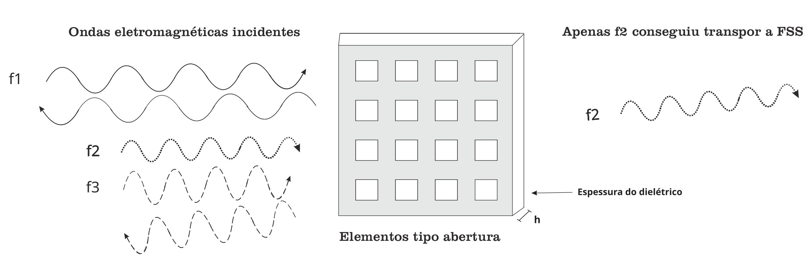
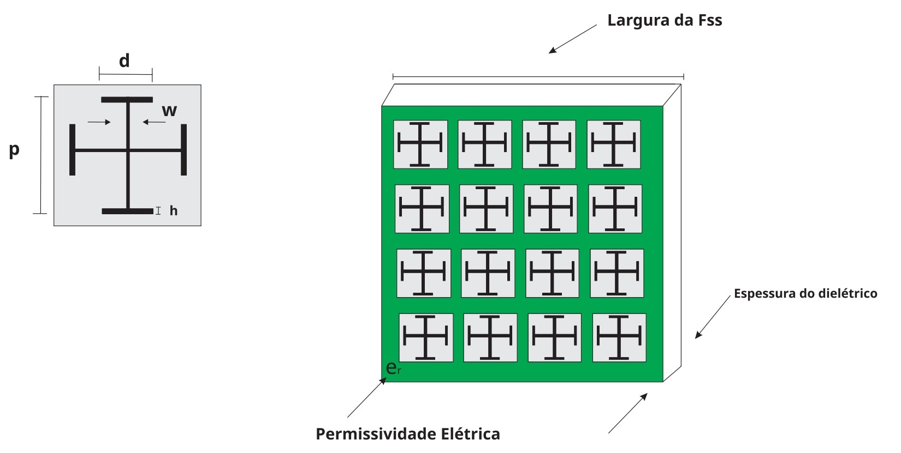

# Superficie Seletiva de Frequencia

#### Projeto da Disciplina Redes Neurais Artificiais (1106525) - 2024.1
###### Professora: [Rosana Rego](https://github.com/roscibely)
<div>
  
</div>
<i> <a href="https://engsoftwarepaudosferros.ufersa.edu.br/apresentacao/"> Curso Bacharel em Engenharia de Computação  </a> - UFERSA - Campus Pau dos Ferros </a></i>

---

As superfícies seletivas de frequência, do inglês <i>Frequency Selective Surface</i> (FSS), são arranjos periódicos dispostos em um substrato dielétrico que têm como
função filtrar determinados tipos de frequência. Dessa forma, podem se comportar como um passa-baixa, passa-alta, rejeita-faixa e passa-faixa.




Este projeto tem como objetivo calcular a largura de banda e a frequência de ressonância para uma geometria do tipo espira quadrada.

Ademais, os novos sistemas de telecomunicações requerem dispositivos que sejam multibanda, de baixo custo e fáceis de projetar. Dessa forma, o uso das redes neurais artificiais (RNA) é requerida, tendo em vista que os <i>softwares</i> comerciais atualmente são custosos do ponto de vista computacional, bem como em relação às suas licenças. Dessa forma, foram utilizadas diversas ferramentas e bibliotecas avançadas para encontrar os parâmetros de saída desejados.

## Parâmetros de entrada

Nesse modelo de rede neural, as entradas são:

- h --> espessura do <i>stub</i>
- p --> periodicidade (quantas vezes o elemento se repete)
- d --> comprimento do dipolo cruzado
- w --> espessura do dipolo

Para exemplificar, a figura abaixo mostra uma geometria do tipo Cruz de Jerusalém.





## Parâmetros de saída

- Largura de banda (BW)
- Frequência de ressonância (RF)


## Requisitos

- Python 3.x
- Bibliotecas Python: NumPy, pandas, cikit-learn etc. 

## Instalação

1. Clone o repositório do GitHub:

```bash
git https://github.com/ClassNeuralNetwork/superficie_seletiva_de_frequencia
```

2. Navegue até o diretório do projeto:

```bash
cd superficie_seletiva_frequencia
```

3. Instale as dependências usando pip:

```bash
pip install -r requirements.txt
```

 
 ## Equipe
<table align="center">
  <tr>    
    <td align="center">
      <a href="https://github.com/Lucas-Abrantes">
        <br>
        <sub>
          <b>Lucas Abrantes</b>
         </sub>
      </a>
    </td>
  </tr>
</table>


## Agradecimentos

Agradeço a toda comunidade de código aberta pelas ferramentas como o scikit-learn, que foram de suma importância para o desenvolvimento desse projeto.
